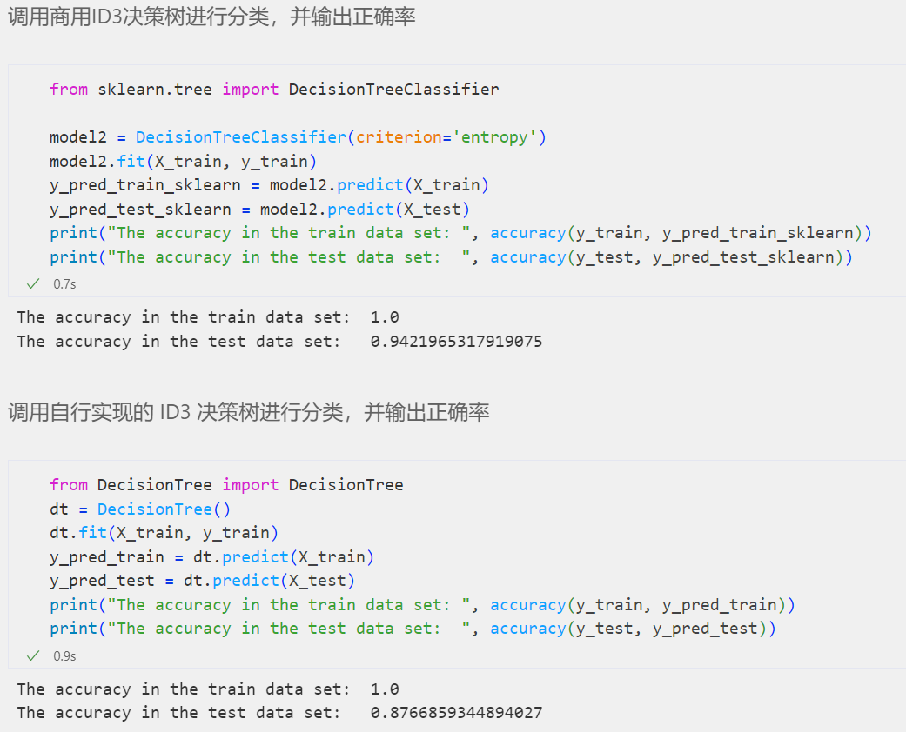
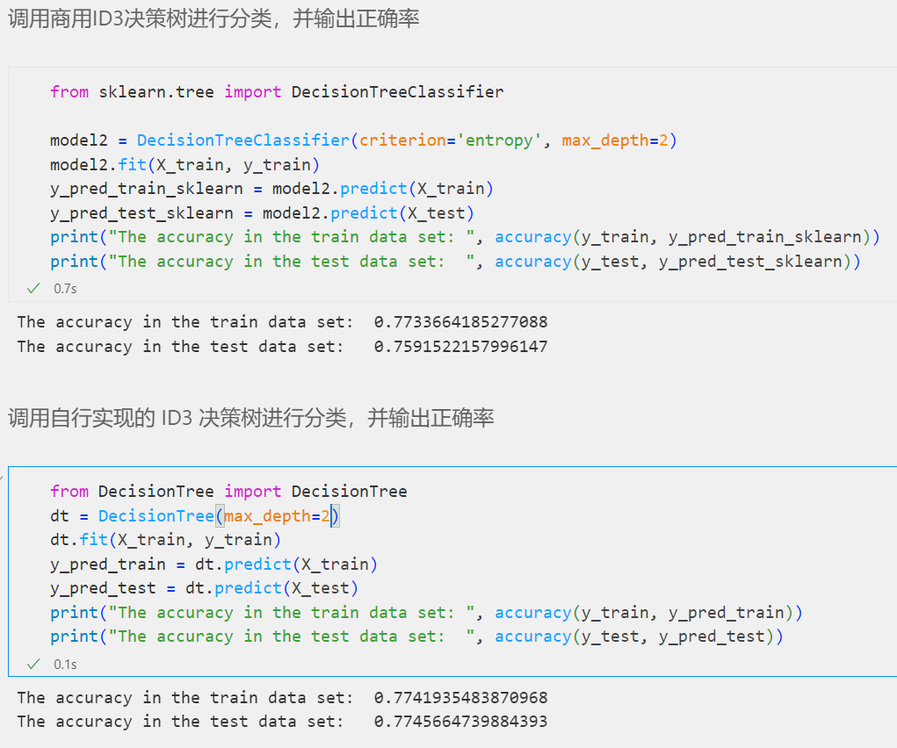
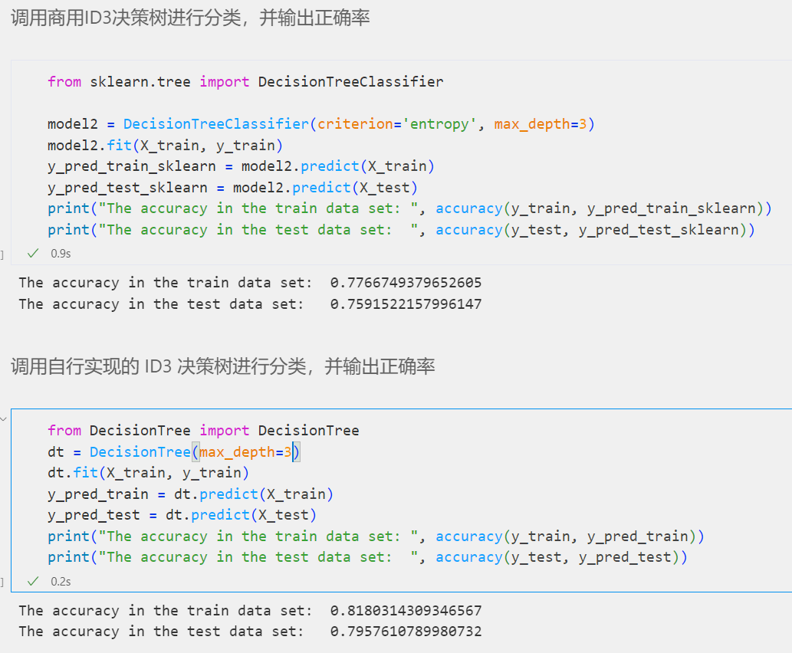
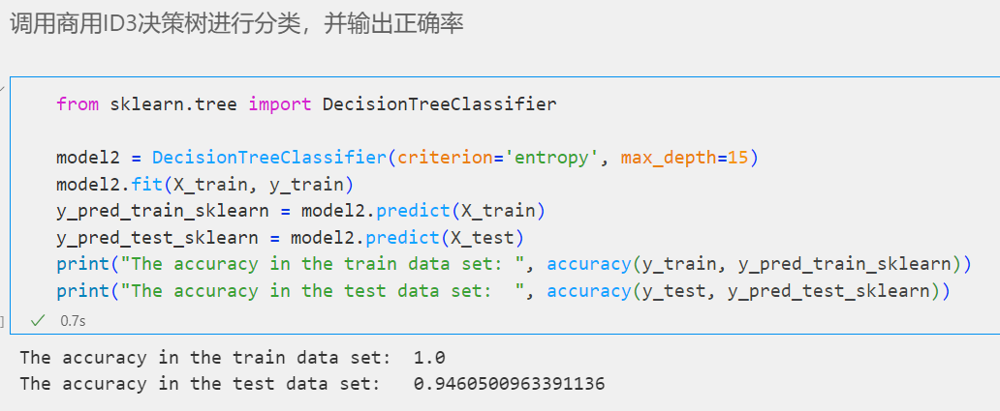
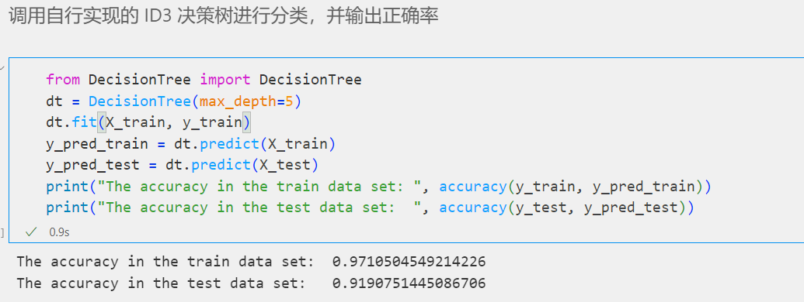
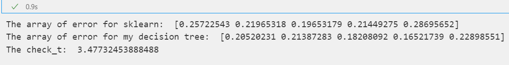
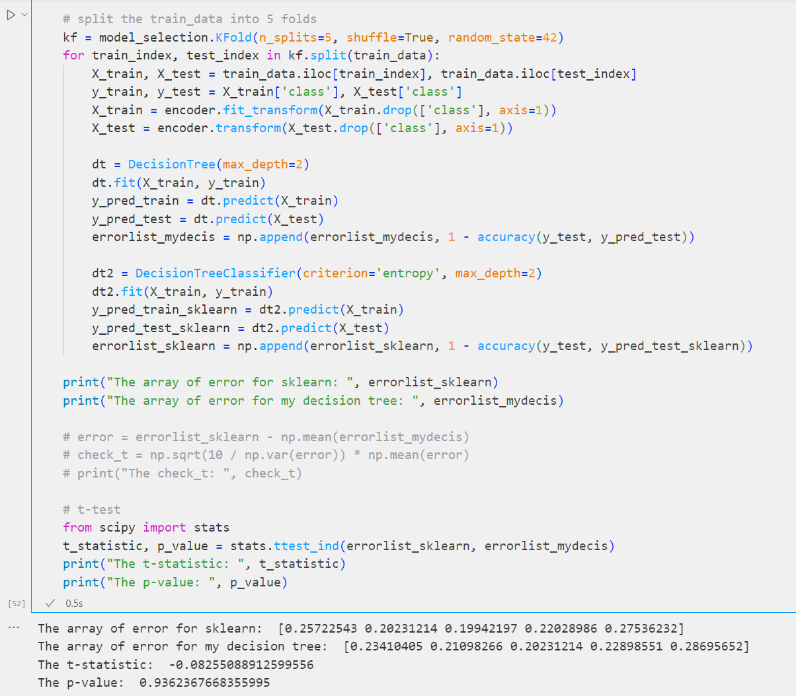

# 作业2：决策树

[TOC]

## 文件结构介绍

* DecisionTree：自行实现的ID3决策树类
* Lab2.ipynb：调用和对比的过程
* README.md：文档


## 数据集介绍

此实验使用kaggle上评价汽车的数据集

* buying: 购买价格，分有v-high, high, med, low四个等级
* maint：维护价格，分有v-high, high, med, low四个等级
* doors：门的数量，分有2, 3, 4, 5-more四个等级
* persons：载人数，分有2, 4, more三个等级
* lug_boot：行李箱大小，分有small, med, big三个等级
* safety：安全度，分有low, med, high三个等级
* 目标属性class：对汽车的评价，分有 uacc, acc, good, v-good四个等级

因为此数据集为4种分类结果的问题，所以recall和percision评价在此数据集上无法实现。


## 实验原理

ID3决策树构建算法是一个自顶向下的贪心算法，绝大部分的ID3决策树仅支持nominal特征。

### 基础理论

#### 信息熵

熵 (Entropy) 是对不确定性的测量，在ID3决策树算法中，是对目标特征数据集的“不纯净性”测量，在ID3决策树算法中，熵使用下面的公式计算：

$\operatorname{Entropy}(\mathrm{S})=-\sum \mathrm{p}_{i} * \log _{2}\left(\mathrm{p}_{i}\right) ; i=1$ to $\mathrm{n}$

其中S代表数据集，n是目标列的不同类总数，$p_{i}$是指出现“i”类的可能性。根据上述原理，实现的代码如下：

```python
def Entropy(self, data, attribute):
        column, counts = np.unique(data[attribute], return_counts=True)
        entropy = 0.0
        for i in range(len(column)):
            entropy -= (counts[i] / np.sum(counts)) * math.log2(counts[i] / np.sum(counts))
        return entropy
```

#### 信息增益

信息增益计算熵的减少，并以此度量目标特征如何分离或分类目标。ID3的主要步骤就是选取信息增益最高的特征来分类目标类。

$IG(S, A) = Entropy(S) - \Sigma(\frac{|S_v|}{|S|} * Entropy(S_v))$

* S表示数据集
* A表示计算信息增益的列
* $S_v$表示类A中含有值v的S中的行的集合

根据上述原理，实现的代码如下：

```python
def InformationGain(self, data, feature, target):
        # 计算数据集的熵
        entropy = self.Entropy(data, target)
        # 计算目标特征列的熵
        column, counts = np.unique(data[feature], return_counts=True)
        entropy_feature = 0.0
        for i in range(len(column)):
            entropy_feature += (counts[i] / np.sum(counts)) * self.Entropy(data[data[feature] == column[i]], target)
        # 计算信息增益
        information_gain = entropy - entropy_feature
        return information_gain
```

#### ID3决策树类的数据结构

在本次作业中，我实现了一个决策树类，各类函数的申明和接口定义如下：

```python
class DecisionTree:
    def __init__(self, max_depth=None):
        """ 初始化
        Arguments:
            max_depth: 最大深度 
        """
    
    def Entropy(self, data, attribute):
        """ 计算熵
        Arguments:
            data: 数据集
            attribute: 特征列

        Returns:
            entropy: 熵
        """

    def InformationGain(self, data, feature, target):
        """ 计算信息增益
        Arguments:
            data: 数据集
            feature: 特征列名字
            target: 目标列名字
        
        Returns:
            information_gain: 信息增益
        """

    def ID3(self, data, raw, attributes, target, depth=None, parent=None):
        """ ID3决策树构建
        Arguments:
            data: 待划分的数据集
            raw: 原数据集
            attributes: 待划分的特征列
            target: 目标列名字
            depth: 当前深度
            parent: 父节点
		"""
        
    def predict(self, data):
        """ 预测数据集
        Arguments:
            data: 数据集

        Returns:
            predictions: 预测结果
        """
    
    def predict_one(self, data, tree):
        """ 预测单个数据
        Arguments:
            data: 数据
            tree: 决策树

        Returns:
            prediction: 预测结果
        """

    def fit(self, data, target):
        """ 训练决策树
        Arguments:
            data: 数据集
            target: 目标列名字
        """
```


## ID3决策树算法步骤

### 算法步骤

1. 计算每个特征的信息增益
2. 选取信息增益最大的特征将数据集划分为子集
3. 利用信息增益最大的特征生成决策树结点
4. 如果所有的行属于同一类，使得当前结点为叶子结点并返回
5. 为所有剩下的特征执行上述操作直到没有特征可以划分或决策树生成完成

### 代码实现

采用dict结构来实现ID3决策树，主要步骤由注释给出

```python
def ID3(self, data, row, attributes, target, depth=None, parent=None):
        # 如果只有一类数据，直接返回此类
        if len(np.unique(data[target])) <= 1:
            return data[target].iloc[0]
        # 需要划分的数据集为空，说明已经没有可以划分的属性了，返回出现次数最多的类别
        if len(data) == 0:
            return np.unique(row[target])[np.argmax(np.unique(row[target], return_counts=True)[1])]
        # # 如果已经到达了最大深度，返回出现次数最多的类别
        if self.max_depth is not None and depth >= self.max_depth:
            return np.unique(data[target])[np.argmax(np.unique(data[target], return_counts=True)[1])]
        # 获取信息增益最大的属性
        parent = np.unique(data[target])[np.argmax(np.unique(data[target], return_counts=True)[1])]
        # 计算信息增益
        information_gain = self.InformationGain(data, attributes[0], target)
        # 如果信息增益为0，返回出现次数最多的类别
        if information_gain == 0:
            return data[target].iloc[0]
        # 如果信息增益不为0，则划分数据集
        best_attribute = attributes[0]
        for attribute in attributes[1:]:
            if self.InformationGain(data, attribute, target) > information_gain:
                best_attribute = attribute
                information_gain = self.InformationGain(data, attribute, target)
        # 创建新的划分树
        tree = {best_attribute: {}}
        # 创建子树
        column = np.unique(data[best_attribute], return_counts=True)[0]
        # 在best_attribute属性上划分数据集
        for i in range(len(column)):
            # 创建子树
            tree[best_attribute][column[i]] = self.ID3(data.where(data[best_attribute] == column[i]).dropna(), row, attributes.drop(best_attribute), target, depth + 1, parent)
        return tree
```


## 模型评价

### 正确率与建树时间

在自行的实现的决策树中我同样实现了通过限定最大深度从而对决策树进行剪枝的，因此在这里我通过限制不同剪枝深度来比价自行实现的决策树与sklearn中决策树的正确率与建树时间。

实现对比的代码如下：

Sklearn中ID3决策树的调用

```python
from sklearn.tree import DecisionTreeClassifier

model2 = DecisionTreeClassifier(criterion='entropy')
model2.fit(X_train, y_train)
y_pred_train_sklearn = model2.predict(X_train)
y_pred_test_sklearn = model2.predict(X_test)
print("The accuracy in the train data set: ", accuracy(y_train, y_pred_train_sklearn))
print("The accuracy in the test data set:  ", accuracy(y_test, y_pred_test_sklearn))
```

自行实现的决策树的调用

```python
from DecisionTree import DecisionTree
dt = DecisionTree(max_depth = )
dt.fit(X_train, y_train)
y_pred_train = dt.predict(X_train)
y_pred_test = dt.predict(X_test)
print("The accuracy in the train data set: ", accuracy(y_train, y_pred_train))
print("The accuracy in the test data set:  ", accuracy(y_test, y_pred_test))
```

测试结果如下，**需要注意的是正确率的第一个数字为在训练集上的正确率，而第二个数字是在测试集上的正确率**：

| 剪枝深度 | sklearn正确率 | 自行实现正确率 | sklearn建树时间 | 自行实现建树时间 |
| -------- | ------------- | -------------- | --------------- | ---------------- |
| 不剪枝   | 1.0/0.942     | 1.0/0.877      | 0.7s            | 0.9s             |
| 2        | 0.773/0.759   | 0.774/0.774    | 0.7s            | 0.1s             |
| 3        | 0.777/0.759   | 0.818/0.795    | 0.9s            | 0.2s             |

截图如下：

不进行剪枝：



max\_depth = 2



max_depth = 3



## 最佳正确率

不进行剪枝时，可能会发生过拟合的问题，所以我通过修改最大深度这一参数来简单地试探最佳拟合位置，并且找到在这一维度上的最佳正确率。

对于商用的sklearn决策树来说，最佳的正确率应该在最大深度为15时达到，此时在训练集上的正确率为1，而在测试集上则为0.946，比不限制最大深度时要高，但是无明显区别。



而对于自行实现的决策树来说，最佳的正确率应该在最大深度为5时达到，此时在训练集上的正确率为0.971，而在测试集上则为0.919，比不限制最大深度时要高，有较大区别，并且此时与商用决策树的正确率差别不大。



从上述两点我们可以得知，商用决策树在防止过拟合方面明显做得更好，并且是通过限制最大深度以外的方式进行剪枝来防止过拟合，具体反映在设置最大深度前后正确率差别较小。而自行实现的决策树存在比较大的过拟合问题，并且最大深度剪枝防止过拟合的效果比较好。

### T检验

通过将数据集分为5份再单独进行决策树预测，最后得到错误率向量来计算statistic t的方式完成这一部分内容，实现的代码如下：

```python
from sklearn import model_selection
errorlist_sklearn = np.array([])
errorlist_mydecis = np.array([])

# split the train_data into 5 folds
kf = model_selection.KFold(n_splits=5, shuffle=True, random_state=42)
for train_index, test_index in kf.split(train_data):
    X_train, X_test = train_data.iloc[train_index], train_data.iloc[test_index]
    y_train, y_test = X_train['class'], X_test['class']
    X_train = encoder.fit_transform(X_train.drop(['class'], axis=1))
    X_test = encoder.transform(X_test.drop(['class'], axis=1))

    dt = DecisionTree()
    dt.fit(X_train, y_train)
    y_pred_train = dt.predict(X_train)
    y_pred_test = dt.predict(X_test)
    errorlist_mydecis = np.append(errorlist_mydecis, 1 - accuracy(y_test, y_pred_test))

    dt2 = DecisionTreeClassifier(criterion='entropy')
    dt2.fit(X_train, y_train)
    y_pred_train_sklearn = dt2.predict(X_train)
    y_pred_test_sklearn = dt2.predict(X_test)
    errorlist_sklearn = np.append(errorlist_sklearn, 1 - accuracy(y_test, y_pred_test_sklearn))

print("The array of error for sklearn: ", errorlist_sklearn)
print("The array of error for my decision tree: ", errorlist_mydecis)

error = errorlist_sklearn - np.mean(errorlist_mydecis)
check_t = np.sqrt(10 / np.var(error)) * np.mean(error)
print("The check_t: ", check_t)
```

在均不设置最大深度的情况下进行计算，以$n = 5$，$\alpha =0.05$的标准得到的T参数值为3.477，经查表得知此值远高于标准值2.776，说两个模型存在显著差异。个人推测是由于商用决策树进行了多种优化与剪枝操作。



但值得注意的是，将深度限制为2时，利用sklearn中的t-test测得两种模型有一定的相似性


