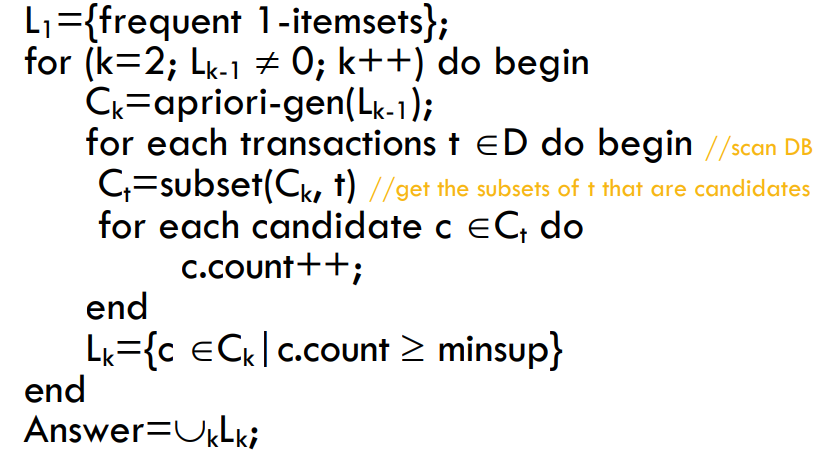
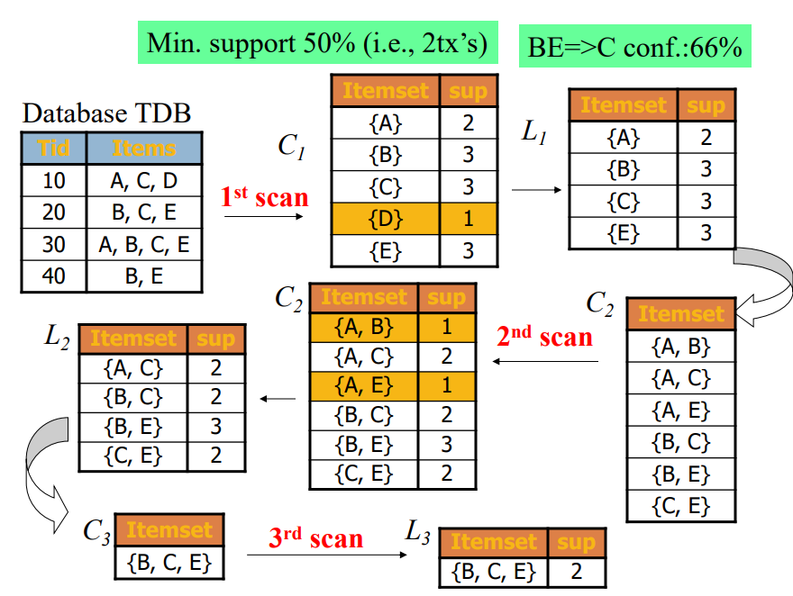
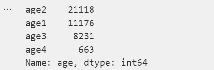
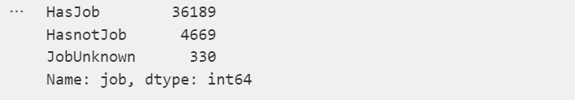
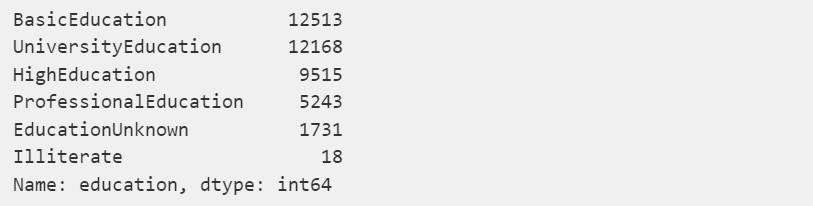
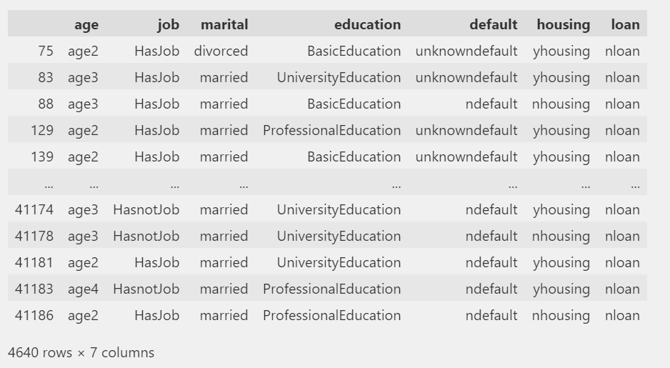
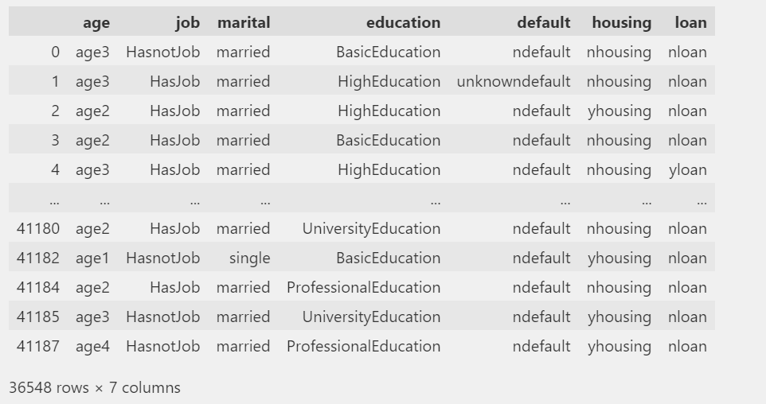
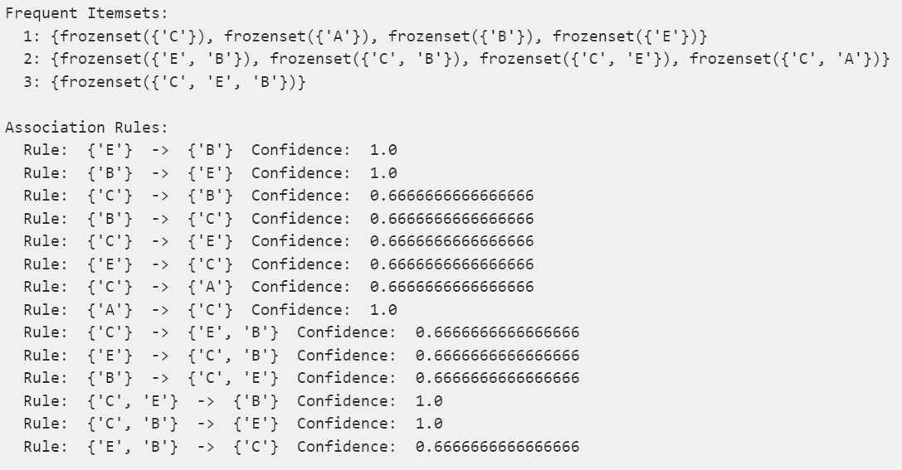
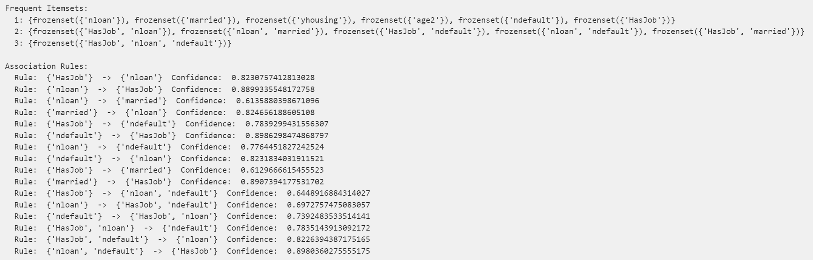
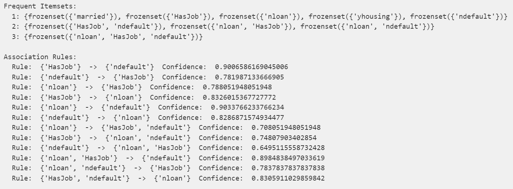

# 作业3：频繁模式挖掘

[TOC]

## 文件结构介绍

* Aprioi.py：自行实现的Aprioi算法类

* lab3.ipynb：数据挖掘过程展示

* .md：说明文档

* /Data：数据文件夹

  

## 数据集介绍

此数据集为kaggle上的银行用户数据集，其中比较重要的属性解释如下：

age：客户年龄

job：客户的职业

marital：客户的婚姻状况

education：客户的教育水平

default：有无信用卡违约

housing：有无房产

loan：有无个人贷款

y：有无认购定期存款


## Aprioi算法理论

Aprioi算法是关联规则挖掘的最经典算法之一，而关联规则挖掘是一种识别不同项目之间潜在关系的技术。本次实验的目标即使自行实现Aprioi算法并在数据集中挖掘出关联规则。

### 支持度

支持度是Aprioi算法步骤中的一个重要的参考指标，它评估事务在总事务中的出现频率，计算方式如下公式所示。


### 置信度

置信度的含义是含有Y的事务同时含有X的概率，能够很好地反映出关联规则是否solid，公式如下所示


### 算法步骤

Aprioi的官方步骤解释为：

* 扫描候选数据集，得到出现过的所有数据作为频繁集$L_k$，k = 1
* 计算$L_k$中的支持度，过滤小于支持度阈值的项得到候选频繁集$C_k$。在此过程中，如果得到的频繁集为空则直接返回k-1频繁集作为算法结果，若得到的频繁集只有一项，则直接返回此频繁集。
* 通过频繁集在此连接得到k + 1候选频繁集，k++进行进一步迭代

通过伪码来便是整个过程则是：

* $L_k$：频繁k项集，满足最小支持度需求
* $C_k$：候选频繁k项集



以最经典的图片为例：




## 具体实现

### 数据结构

在此实验中，我实现了一个Aprioi类，类的成员变量与成员函数定义如下：

```python
class Aprioi:

    def __init__(self, ItemSetList, MinSupport, MinConfidence):
        """
        构造函数
        :param ItemSetList: 数据集
        :param MinSupport: 最小支持度
        :param MinConfidence: 最小置信度
        """

    def apriori(self):
        """
        Apriori算法
        :return: 返回频繁集
        :return: 返回关联规则
        """
    
    def getFrequentItems(self, ItemSet, frequentItemsAll):
        """
        获取频繁集
        :param ItemSet: 集合
        :param frequentItemsAll: 频繁集
        :return: 返回频繁集
        """

    def getAssociationRules(self, frequentItems, frequentItemsAll):
        """
        获取关联规则
        :param frequentItems: 频繁集
        :param frequentItemsAll: 含有支持度的频繁集
        :return: 返回关联规则
        """
```

### Aprioi算法实现

算法的实现完全参照实验原理部分的伪码步骤，并且附有较为详细的注释。值得注意的是虽然输入的项集是嵌套list但是我在开始会将它们转为set，其中一个最主要的原因就是set使用hashtable实现并且自带不可重复属性，大大简化了后续操作流程并提高了运行效率。

同时由于set仅支持不可变数据类型，所以我使用frozenset进行嵌套。

```python
def apriori(self):
        """
        Apriori算法
        :return: 返回频繁集
        :return: 返回关联规则
        """
        frequentItems = {}
        frequentItemsAll = {}

        # 将嵌套列表转为嵌套集合（集合使用hashtable的方式进行组织）
        C1ItemSet = set()
        for itemSet in self.ItemSetList:
            for item in itemSet:
                C1ItemSet.add(frozenset([item]))
        # 算法的第一步骤，获取频繁1-项集
        L1ItemsSet = self.getFrequentItems(C1ItemSet, frequentItemsAll)
        # 从k = 2开始循环判断
        CurLSet = L1ItemsSet
        k = 2
        while CurLSet:
            frequentItems[k - 1] = CurLSet
            # 通过连接操作获取候选频繁k-项集
            CkItemSet = set([i.union(j) for i in CurLSet for j in CurLSet if len(i.union(j)) == k])
            # 删除不满足规则的组合
            temp = CkItemSet.copy()
            for item in CkItemSet:
                subsets = combinations(item, k - 1)
                for subset in subsets:
                    if(frozenset(subset) not in CurLSet):
                        temp.remove(item)
                        break
            CkItemSet = temp
            # 算法的第k步骤，获取频繁k-项集
            CurLSet = self.getFrequentItems(CkItemSet, frequentItemsAll)
            # 继续迭代
            k += 1

        # 通过频繁项集获取关联规则
        associationRules = self.getAssociationRules(frequentItems, frequentItemsAll)
        return frequentItems, associationRules
```

### 获取k-项频繁集

此函数比较简单，遍历项集并统计出现次数，最后通过支持度计算公式（如前所述）筛选出符合要求的项

```python
def getFrequentItems(self, ItemSet, frequentItemsAll):
        """
        获取频繁集
        :param ItemSet: 集合
        :param frequentItemsAll: 频繁集
        :return: 返回频繁集
        """
        frequentItemsSet = set()
        frequentItems = {}
        for item in ItemSet:
            for itemSet in self.ItemSetList:
                if item.issubset(itemSet):
                    if item in frequentItems:
                        frequentItems[item] += 1
                    else:
                        frequentItems[item] = 1
                    
                    if item in frequentItemsAll:
                        frequentItemsAll[item] += 1
                    else:
                        frequentItemsAll[item] = 1
        
        for item, sup in frequentItems.items():
            if float(sup / len(self.ItemSetList)) >= self.MinSupport:
                frequentItemsSet.add(item)
        
        return frequentItemsSet
```

### 寻找关联规则

通过powerset来寻找关联规则，并且计算每个规则的置信度，筛选出符合要求的规则。

```python
def getAssociationRules(self, frequentItems, frequentItemsAll):
        """
        获取关联规则
        :param frequentItems: 频繁集
        :param frequentItemsAll: 含有支持度的频繁集
        :return: 返回关联规则
        """
        associationRules = []
        for num, itemSet in frequentItems.items():
            for item in itemSet:
                # 计算item的powerset
                subsets = chain.from_iterable(combinations(item, r) for r in range(1, len(item)))
                # 对于powerset中的每一个子集，计算置信度
                for s in subsets:
                    # 通过置信度计算关联规则
                    confidence = float(frequentItemsAll[item] / frequentItemsAll[frozenset(s)])
                    if(confidence >= self.MinConfidence):
                        associationRules.append([set(s), set(item.difference(s)), confidence])
        
        return associationRules
```


## 实验结果与分析

### 数据预处理（详细过程见ipynb文件）

#### 布尔值预处理

首先由于Apriori是处理属性名之间的联系，所以布尔类的重名不经处理会导致错误。所以先将每个布尔值转为带便签的布尔值，如下所示：

```python
train_data['default'] = train_data['default'].map({'yes': 'ydefault', 'no': 'ndefault', 'unknown': 'unknowndefault'})
train_data['housing'] = train_data['housing'].map({'yes': 'yhousing', 'no': 'nhousing', 'unknown': 'unknownhousing'})
train_data['loan'] = train_data['loan'].map({'yes': 'yloan', 'no': 'nloan', 'unknown': 'unknownloan'})
```

#### 年龄预处理

其次Aprioi本事上还是用于处理分类属性，所以需要将age这一连续属性进行一个转化

```python
train_data.loc[train_data['age'] <= 16, 'age'] = 0
train_data.loc[(train_data['age'] > 16) & (train_data['age'] <= 32), 'age'] = 1
train_data.loc[(train_data['age'] > 32) & (train_data['age'] <= 48), 'age'] = 2
train_data.loc[(train_data['age'] > 48) & (train_data['age'] <= 64), 'age'] = 3
train_data.loc[train_data['age'] > 64, 'age'] = 4
train_data['age'] = train_data['age'].astype(int)
train_data['age'] = train_data['age'].map({0: 'age0', 1: 'age1', 2: 'age2', 3: 'age3', 4: 'age4'})
train_data['age'].value_counts()
```

转化后的结果为：



#### 职业预处理

同样的，由于职业过多，并且职业之间的差别对发放贷款的影响没有有无稳定职业对发放贷款的影响下大，所以我选择将职业值分为两类，一类为有稳定工作，一类为无稳定工作，具体处理过程如下：

```python
JobDict = {}
JobDict['admin.'] = 'HasJob'
JobDict['blue-collar'] = 'HasJob'
JobDict['entrepreneur'] = 'HasJob'
JobDict['housemaid'] = 'HasnotJob'
JobDict['management'] = 'HasJob'
JobDict['retired'] = 'HasnotJob'
JobDict['self-employed'] = 'HasJob'
JobDict['services'] = 'HasJob'
JobDict['student'] = 'HasnotJob'
JobDict['technician'] = 'HasJob'
JobDict['unemployed'] = 'HasnotJob'
JobDict['unknown'] = 'JobUnknown'
train_data['job'] = train_data['job'].map(JobDict)
train_data['job'].value_counts()
```

分类后的结果如下所示



#### 教育水平预处理

教育水平数据同样不需要原数据集这样细化，我将它们重新分类为文盲、基础教育、高中教育、高等教育、职业教育这几个类型

```python
EducationDict = {}
EducationDict['basic.4y'] = 'BasicEducation'
EducationDict['basic.6y'] = 'BasicEducation'
EducationDict['basic.9y'] = 'BasicEducation'
EducationDict['high.school'] = 'HighEducation'
EducationDict['illiterate'] = 'Illiterate'
EducationDict['professional.course'] = 'ProfessionalEducation'
EducationDict['university.degree'] = 'UniversityEducation'
EducationDict['unknown'] = 'EducationUnknown'
train_data['education'] = train_data['education'].map(EducationDict)
train_data['education'].value_counts()
```

处理后的结果为




### 应用Aprioi算法

经过上述处理并且除去一些不重要或者此次实验中不关心的属性之后，数据集变为：

认购定期存款的人群：



不认购定期存款的人群：



### 验证自行实现算法的正确性

首先使用一个简单的例子来验证算法的正确性，以课件上的图为例


```python
from Aprioi import Aprioi
itemSetList2 = [
    ['A', 'C', 'D'],
    ['B', 'C', 'E'],
    ['A', 'B', 'C', 'E'],
    ['B', 'E']
]

tree = Aprioi(itemSetList2, 0.5, 0.5)
freqItemSet, associationRules = tree.apriori()
print('Frequent Itemsets:')
for key, value in freqItemSet.items():
    print('  {}: {}'.format(key, value))

print('\nAssociation Rules:')
for rule in associationRules:
    print('  Rule: ', rule[0], ' -> ', rule[1], ' Confidence: ', rule[2])
```

调用的结果为



可以看到输出的结果和例图完全一直，由此可以初步验证正确性

### 数据集应用

将Aprioi算法用在没有认购定期存款的数据子集上，代码与结果为：

```python
from Aprioi import Aprioi

itemSetList = []   
for i in range(0, len(train_data_categrical_n)):
    itemSetList.append(set(train_data_categrical_n.iloc[i]))

tree = Aprioi(itemSetList, 0.5, 0.5)
freqItemSet, associationRules = tree.apriori()
# print the frequent itemsets
print('Frequent Itemsets:')
for key, value in freqItemSet.items():
    print('  {}: {}'.format(key, value))

print('\nAssociation Rules:')
for rule in associationRules:
    print('  Rule: ', rule[0], ' -> ', rule[1], ' Confidence: ', rule[2])
```



从上结果可以知道：

* 有稳定工作或已婚的人往往是没有个人贷款的，并且没有信用卡违约记录和没有个人贷款联系也非常紧密。
* 有工作的人很大概率是不会有信用卡违规记录的，并且有信用卡违规记录的人非常可能没有稳定的工作
* 结了婚的人很大概率是有稳定工作的，但有稳定工作是已婚人士的概率就要小很多，不多一样比是未婚人士的可能性大
* 综合来看，有稳定工作并且没有贷款的人士不太可能有信用卡违约记录，有稳定工作并且没有信用卡违约记录的人士非常大概率也不会有个人贷款，值得注意的是，没有信用卡违规记录并且个人贷款的绝大部分都是有稳定工作的。

对于认购了定期存款的数据集来说，结果类似

```python
itemSetList = []   
for i in range(0, len(train_data_categrical_y)):
    itemSetList.append(set(train_data_categrical_y.iloc[i]))

tree = Aprioi(itemSetList, 0.5, 0.5)
freqItemSet, associationRules = tree.apriori()
# print the frequent itemsets
print('Frequent Itemsets:')
for key, value in freqItemSet.items():
    print('  {}: {}'.format(key, value))

print('\nAssociation Rules:')
for rule in associationRules:
    print('  Rule: ', rule[0], ' -> ', rule[1], ' Confidence: ', rule[2])
```


