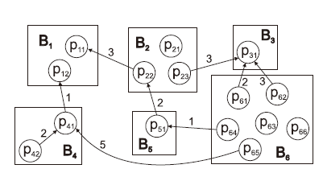
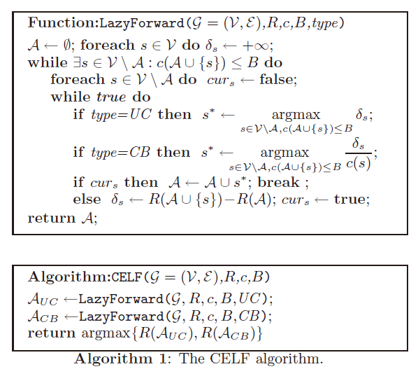
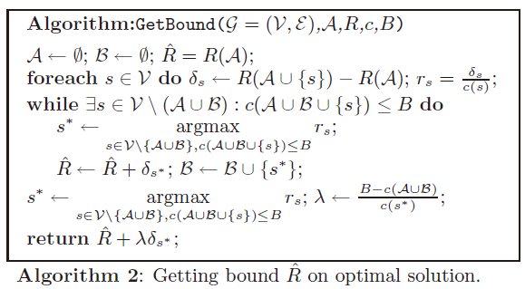
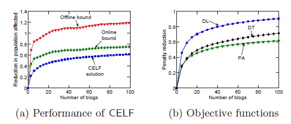
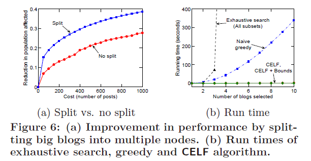
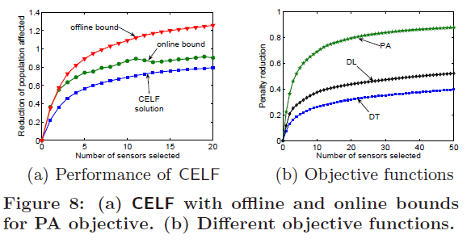
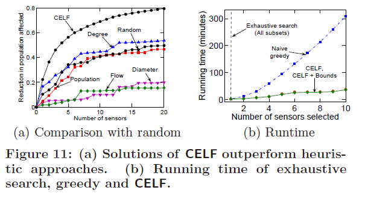

# Cost-effective Outbreak Detection in Networks

[TOC]

## 论文背景

本文是获得KDD 2019年经典论文奖(Test of Time Award)的一篇关于知识发现与社交网络影响力主题的论文，第一次发表于2007年，十多年间被广泛使用并且在此领域经久不衰。

社交网络模型和影响力传播模型是数据挖掘领域和知识发现领域非常重要的一类问题。通常来说，社交网络影响力传播领域致力于解决如何刻画影响力在社交网络中的传播模式，也即社交网络中的结点的状态如何影响到其相邻的节点，并且造成某一状态(通常指活跃状态)在网络中的扩散传播。早在2003年，Kempe & Kleinberg就提出了经典的独立级联模型(IC)来解释这一问题，它是一种发掘离散时间递进性的传播模型，本质上为Greedy算法，但这一方法的缺点也非常明显，无法保证最差复杂度和运行速度，在更加广泛的场景中无法做出有效的解释。

本文的提出在很大程度上缓解了这一问题，本文提出的CELF算法通过进一步发掘利用影响力的子模性(submodularity)，即边际影响力增量会呈现递减的趋势改进了Kempe & Kleinberg的Greedy算法，将运算速度提高了700倍以上。

## 论文解决的问题

本文用两个最典型的应用实例来具象化了论文需要解决的问题：

* **水质检测**：水的供给网络里安装检测水质污染的传感器，因为传感器成本高昂，因此只能在部分节点安装，应该如何安装传感器使得在可以接受的成本范围内将水污染在整个网络中造成的影响降至最低？
* **博客圈检测问题**：一系列博客通过超链接形成博客网络，如何阅读能够保证在阅读量可以接受的范围内找到关键信息？

上面两个问题总的来说都是在一个图$\mathcal{G}=(\mathcal{V}, \mathcal{E})$ (博客/水网络)上寻找一个节点子集$A$(传感器位置/阅读的博客)，通过这一子集，我们就能够快速找到关键内容。

以下图为例，箭头表示博客之间的超链接，箭头指向信息来源，也即可以透过箭头的反向找到信息级联。

从上图我们可以得知通过阅读B6所示的博客块，我们可以找到所有博客信息，但是B6区域需要阅读6篇博客，而通过阅读B1和B2，我们可以更快地找到所有级联信息。将这个例子抽象化，我们可以这个问题表述为：

寻找一个子集$A$，定义它的代价$c(\mathcal{A})=\sum_{s \in \mathcal{A}} c(s)$，通过综合考量奖励(Reward)和代价，使得：
$$
\max _{\mathcal{A} \subseteq \mathcal{V}} R(\mathcal{A}) \text { subject to } c(\mathcal{A}) \leq B
$$
R为奖励函数，B为可以接受的最大代价。

## 论文使用的方法

### 奖励和惩罚函数

解决前一部分的问题很重要的一个任务就是决定奖惩函数，在水质检测或博客网络阅读问题上怎样的动作或子集会收到何种效益决定了操作的选择。这一部分，首先将各种评价标准下的奖惩函数进行分类讨论。

一个非常直观的例子就是在水质检测中，时间是影响乘法函数的重要因素：随着污染时间的增加，所带来的损失必然就会进一步增加。将这个例子进一步抽象化后，得到下面这一个惩罚函数的表达式：
$$
\pi(\mathcal{A}) \equiv \sum P(i) \pi_{i}(T(i, \mathcal{A}))
$$
其中$A$为选择的子集，而$T(i, \mathcal{A})=\min _{s \in \mathcal{A}} T(i, s)$用具象化的语言描述来说就是事件i被子集$A$中的传感器检测到所经历的时间，$P$则是事件的概率分布。

有了惩罚函数的定义，奖励函数也就是通过操作挽回的损失：
$$
R(\mathcal{A})=\sum_{i} P(i) R_{i}(\mathcal{A})=\pi(\emptyset)-\pi(\mathcal{A})
$$
在这篇论文中，考虑如下几种奖惩函数的设置方式：

* Detection likelihood (DL)：信息级联与被选中节点检测到的污染时间因子

  也就是说仅关注能否检测到污染，而不关注检测到需要的有限时间 ( $\pi(t) = 1 \& \pi(inf) = 0$)

* Detection time (DT)：计算从污染被选中节点检测到的时间，并将其作为考虑之一

* Population affected (PA)：考虑污染未被检测到所造成的影响范围

### 函数性质及优化

发掘奖惩函数的性质是本文的重点，其中最重要的就是函数的子模性：

**子模性**：对于所有子集$\mathcal{A} \subseteq \mathcal{B} \subseteq \mathcal{V}$和传感器$s \in \mathcal{V} \backslash \mathcal{B}$，有以下关系：
$$
R(\mathcal{A} \cup\{s\})-R(\mathcal{A}) \geq R(\mathcal{B} \cup\{s\})-R(\mathcal{B}) .
$$
用更加通俗的语言来解释便是：通过增加传感器获得的增益是非递减的，在传感器越多的情况下增加传感器，获得的增益至少不会高于之前的增益。有了这样一个性质，本文提出的问题就能规约到最大化一个非递减的子模性函数上。

### 贪心算法

通常来说，最大化一个非递减的子模性函数是一个NP-hard问题，我们首先可以从问题的简化版入手：将所有节点的代价(也即选择某个节点付出的成本)均衡化，比如都设为1，这样贪心算法解决这一问题的步骤就非常清晰：初始选择节点集合$\mathcal{A}_{0}=\emptyset$，迭代k步，每次均选择最大化边际增益的位置：
$$
s_{k}=\underset{s \in \mathcal{V} \backslash \mathcal{A}_{k-1}}{\operatorname{argmax}} R\left(\mathcal{A}_{k-1} \cup\{s\}\right)-R\left(\mathcal{A}_{k-1}\right)
$$
直到选到代价超过可接受范围，可是这样一种贪心算法是不能保证最差复杂度的，在很多情况下效果会非常的差，但是结果分数在可以接受的范围内，具体来说：

**理论2**：如果R函数具有子模性，那么贪心算法能够找到满足$R\left(\mathcal{A}_{G}\right) \geq(1-1 / e) \max _{|\mathcal{A}|=B} R(\mathcal{A})$的集合$\mathcal{A}_{G}$

在代价均衡化的前提下，我们可以知道贪心算法可以给出一个分数至少在最优解$1 - 1/e$ (63%)水平的解。那么需要考虑代价不均衡的情况该何如处理呢？贪心算法同样能根据上述简单情况稍加拓展，将考虑收益改为考虑性价比(benefit / cost ratio)。选择的位置：
$$
s_{k}=\underset{s \in \mathcal{V} \backslash \mathcal{A}_{k-1}}{\operatorname{argmax}} \frac{R\left(\mathcal{A}_{k-1} \cup\{s\}\right)-R\left(\mathcal{A}_{k-1}\right)}{c(s)}
$$
简单粗暴的策略无法满足接近最优解的需求，下一小节将会阐述本文的优化算法

### CEF算法

CEF算法首先会选择计算两个子集，分别是通过设想代价均衡的贪心集合$\mathcal A_{GUC}$和考虑性价比的贪心集合$\mathcal A_{GUB}$， 再从满足预算需求的两个子集中选择分数最高的一个，虽然这样的算法依旧无法保证最差复杂度，但它能在代价不均衡的条件下获得解决最优解的分数：

**理论3**：如果R拥有子模性，那么有：
$$
\max \left\{R\left(\mathcal{A}_{G C B}\right), R\left(\mathcal{A}_{G U C}\right)\right\} \geq \frac{1}{2}(1-1 / e) \max _{\mathcal{A}, c(\mathcal{A}) \leq B} R(\mathcal{A})
$$
上面理论可以被规约到MAX-COVER问题证明。换句话说，CEF算法能在通用情形下至少获得最优解31%的水平。

### 算法的优化

* 加速奖惩函数计算

  从上述两个例子我们可以知道，大部分的outbreak都是稀疏的，只会影响网络的一小部分区域并且被一小部分节点检测到，因此大部分节点不会引起奖惩。基于这样一个事实，我们可以利用具有稀疏性的奖惩函数R作为一个**倒排索引**，允许通过传感器的索引快速查找奖惩结果，由此我们就能够快速计算奖惩而不用扫描整个数据集。
  $$
  R(\mathcal{A})=\sum_{i: i \text { detected by } \mathcal{A}} P(i) \max _{s \in \mathcal{A}} R_{i}(\{s\})
  $$

* 减少奖惩计算

  即便我们加速了计算奖惩函数的速度，但是大量的函数计算仍然会使算法的速度和复杂度令人无法忍受，因此这一小节提出一种方法来减少对奖惩函数的计算次数。

  假定我们已经计算过每个位置s的边际增益：$\delta_{s}(\mathcal{A})=R(\mathcal{A} \cup\{s\})-R(\mathcal{A})\left(\right.$ or $\left.\delta_{s}(\mathcal{A}) / c(s)\right)$随着选中节点集合不断扩大，边际增益永远不会再增加(前面提到的子模性)，所以我们在计算新添加的节点所带来的边际增益时，我们不再每次都重新计算，而是采用一种懒惰更新的方式：首先假设所有位置的边际增益都是不清楚的，并初始化一个边际增益的优先队列，当找到下一个节点的添加位置时，我们以递减的次序遍历它的边际增益，如果优先队列顶端的增益是不清楚的，那么计算边际增益并加入优先队列。

CEF算法经过这两项优化，就形成了本文提出的算法CELF算法。

### 算法的伪码

根据上述提到的原理和算法步骤，CELF算法的伪代码如下：

与最优解比较的评估范围为：

## 论文的结果

本文通过在前提到的两个问题上评估算法的质量，由于实验环境的描述和测试设备的选择不是文献阅读的重点，在此只阐述重要结果。

### 博客网络

在博客问题上，CELF算法的表现和不同奖惩函数选择带来的影响如下：

根据上图所示，可以看到CELF算法的结果无论在哪个数量的博客上都更加接近底线，肯定也更加接近最优解，而在这个问题上，PA奖惩函数能够获得最佳表现。

从执行时间上来讲，下图能够非常直观地反映结果，穷举搜索的时间是随着博客数量的选择指数型增长的，而原始的贪心算法也是多项式级增长，而CLEF算法确没有太大的改变，展示了此算法的优越性。

### 供水网络

与博客网络的结果类似，CELF算法在这一问题上也展示了它更加接近最优解的优秀表现，但是此问题上DT评价标准更加符合问题需求，与博客网络稍有不同。

以下两图从运行效果和运行时间展示了CELF算法的优势，a展示了它对层级方式和随机方式选择方法的优势，而b展示了它在穷举和贪心算法面前的运行时间优势。

## 未来工作和你的看法

本文在独立级联模型上做出的优化和CELF算法的提出使得传播力影响模型向前迈进了一大步，能够在特定的一些应用场景中发挥它的作用。但是目前为止，对于更适于描述复杂传播行为的阈值模型还缺乏实际数据的有效验证。线性阈值模型对阈值的随机性要求有局限性，而如果用更一般的阈值模型很可能会使模型不具备子模性等性质，从而无法设计有效的算法。所以对于阈值模型，从数据分析到建模和优化还都有不少问题要解决。

另外，本文对传播研究都是在静态网络中进行，而实际网络都是动态变化的。如何将传播的动态性和网络的动态性合理结合，以达到有效的分析、建模和优化，也是一个需要更多关注的课题。